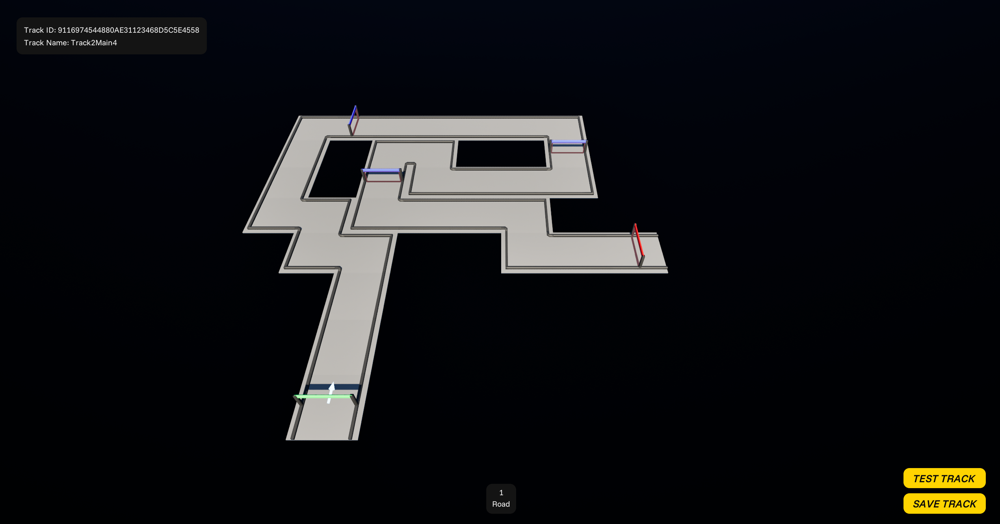
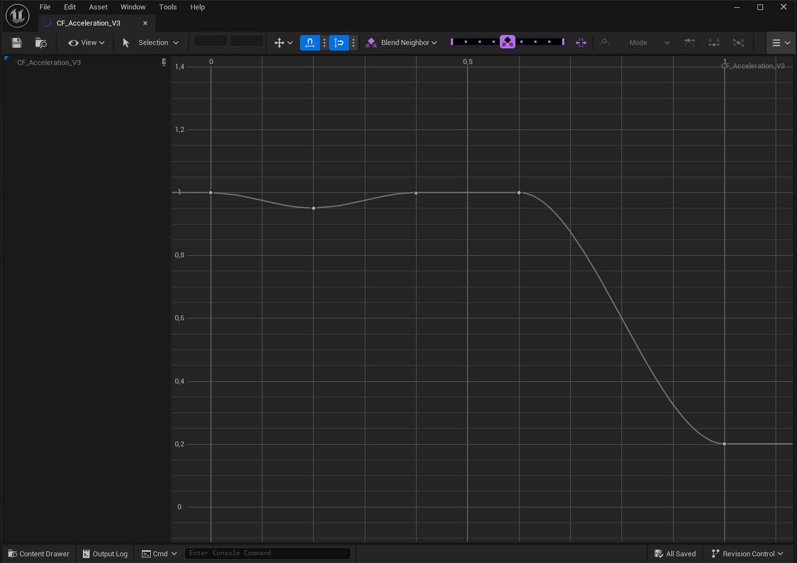
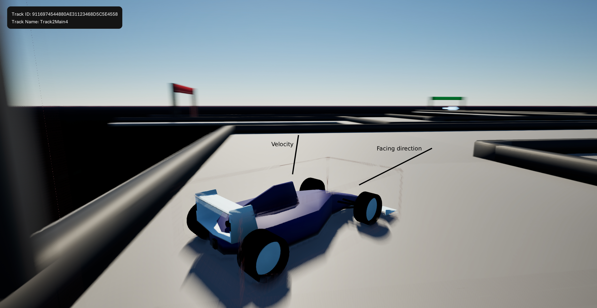

# Spinning Wheels - Unreal Engine Project

Multiplayer, TrackMania-inspired, Unreal Engine C++ Project.

## Demo

Video: https://youtu.be/pqC2QsMiF80

Release download: https://github.com/davidemarchesan/unreal-spinning-wheels/releases

## Commands

### Race

| | |
| --- | --- |
| Accelerate | Arrow Up |
| Brake | Arrow Down / Left Ctrl |
| Turn left | Arrow Left |
| Turn right | Arrow Right |
| Turbo | Space Bar |
| Canc | Restart lap |

### Editor

| | |
| --- | --- |
| Move camera | W / A / S / D |
| Rotate camera | Q / E |
| Select block to build | 1 - 9 |
| Build | Left mouse button |
| Rotate block | Mouse wheel |
| Cancel build | Right mouse button / Esc |

## Key features

- Track editor
- Grid system
- Car custom movement physics
- Deterministic lap times
- Multiplayer and Steam
- Meshes and Blender

### Track editor

Like TrackMania, the player can create custom tracks with a simple editor and test them on the fly. The player have 5 types of blocks at its disposal:
- standard
- turn
- start
- checkpoint
- finish

The player can save the track (it'll be saved as simple json file) and edit it in the future.

### Grid system

When loading a track, in both race and editor modes, a grid system is in charge of reading a specific struct (which comes from reading the json file) that tells which block goes in which cell (X, Y) with a specific rotation (R).

Then, the grid system will spawn all the blocks for the track.

### Car custom movement physics

To create something like TrackMania's car movement, a custom movement component has been created which handle the power-slide, most important game mechanic that lets the player gain advantage on tight corners.

Acceleration: determines how much the car accelerate at a certain speed.
Angular speed: determines how much the car turns at a certain speed.
Braking: determines how much brake force is being applied after time since starting braking (the more time braking, the more brake force).
Speed: is determined by adding up forces like acceleration, braking or ground friction.
Velocity: direction vector. Determines where the car is moving but not necessarily the facing direction.

Turbo: consumable that increases acceleration when active. Resets each lap.

Curves like acceleration, braking and angular speed are determined by pre-defined custom curves (there are no gears, torque or traction systems).

The car has three main modes:
- drive
- slide
- crash

#### Drive

On drive mode, the velocity vector is equal to the facing direction.

#### Slide

On slide mode, the velocity vector and facing direction are not the same. For example, when starting sliding for a right turn, the car wants to turn right but the velocity vector is still pointing forward. 

While sliding, the velocity direction is interpolated to the desired direction, that is the facing direction. Also, more friction force is applied while sliding, resulting in a slower speed.

When velocity vector and facing direction vector are the same, the car returns on drive mode.

#### Crash

The car enter crash mode when hitting a wall at high speed. The speed is cut by a percentage and the velocity vector is changed to the hit point bounce vector. 

Also, the car starts spinning. When the spinning speed comes down to a controllable value, the player can retake control of the car on slide mode.

If the angle between velocity vector and impact normal is less than some pre-defined degrees, the car will slide along the wall, but will still be penalized on speed.

### Deterministic lap times

Lap time is determined by the number of simulated movements that occured to complete a lap. Car does not move each frame, but each custom pre-defined delta (120hz = 0.008333s or 8.333ms). If the difference between two frames is enough to contain two simulated movements, then two simulated movements will be computed. Likewise, if the difference is not enough, no simulated movements will be computed but, the time will be considered for the next simulation.

Hence, lap times are determined by the number of simulated movements multiplied by the pre-defined delta (1000 movements * 8.333ms = 8333ms = 8.333s).

#### Deterministic movement

Accordingly, the car reads a buffer of simulated movements and consume them, one by one. A single movement is constructed of:
- drive input (0/1)
- brake input (0/1)
- turn input (-1/0/+1)
- turbo input (0/1)

Right now the car moves because simulated movements are passed by the controller. But for replays or ghosts, we could just push a pre-defined buffer of simulated movements into the car and it'll start moving without being directly controlled.

### Multiplayer and Steam

The race mode is multiplayer ready where everything is being replicated and synced.

The race is mode is divided in main phases:
- waiting for players.
- racing: players can control their cars.
- podium: leaderboard is shown. Players can not control their cars.

The server holds the leaderboard and decide wether to accept lap times from players. Changes to the leaderboard are spread to players whom HUD will notify them.

The player can choose to play solo (LAN), join a LAN race or start a Steam session. When creating a session (solo or Steam) the server will play all saved tracks for 5 minutes each.

### Meshes and Blender

Car and track blocks meshes are simple but custom-made by me. Just wanted to give it a try :)

## Future improvements

Below, features that are planned to be implemented or could be future improvements. 

#### 3D Grid system, jumps and fly physics

Right now, there is no verticality in the track. However, adding ramps would also mean to handle jumps and flying physics.

#### Car skeleton and animations

Add skeleton and animations to the car like wheels spinning and turning.

#### Car skin customization

The car mesh is already built to support multiple materials. So it would be possible to customize parts color. 

#### Car active aerodynamics and downforce

The original idea was to be able to change front and rear wings angle to generate less or more downforce.

Downforce would also change how fast the car can go through corners, and how much the car can turn at a certain speed.

#### Track validation

When creating and saving a track, it should be validated. For example, a track must have a starting point and at least one finish point.

#### Server lap validation

The server should validate local player lap time.

For example, number of checkpoints passed, or incongruences in simulated movements